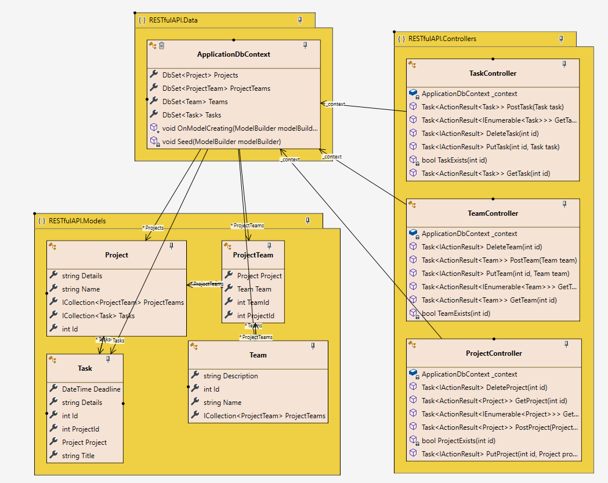

# Реалізація інформаційного та програмного забезпечення

## SQL-скрипт для створення та початкового наповнення бази даних
```

-- MySQL Workbench Forward Engineering

SET @OLD_UNIQUE_CHECKS=@@UNIQUE_CHECKS, UNIQUE_CHECKS=0;
SET @OLD_FOREIGN_KEY_CHECKS=@@FOREIGN_KEY_CHECKS, FOREIGN_KEY_CHECKS=0;
SET @OLD_SQL_MODE=@@SQL_MODE, SQL_MODE='ONLY_FULL_GROUP_BY,STRICT_TRANS_TABLES,NO_ZERO_IN_DATE,NO_ZERO_DATE,ERROR_FOR_DIVISION_BY_ZERO,NO_ENGINE_SUBSTITUTION';

-- -----------------------------------------------------
-- Schema schema
-- -----------------------------------------------------
DROP SCHEMA IF EXISTS `schema` ;

-- -----------------------------------------------------
-- Schema schema
-- -----------------------------------------------------
CREATE SCHEMA IF NOT EXISTS `schema` DEFAULT CHARACTER SET utf8 ;
USE `schema` ;

-- -----------------------------------------------------
-- Table `schema`.`Project`
-- -----------------------------------------------------
CREATE TABLE IF NOT EXISTS `schema`.`Project` (
  `idProject` INT NOT NULL AUTO_INCREMENT,
  `name` VARCHAR(45) NOT NULL,
  `description` VARCHAR(256) NOT NULL,
  PRIMARY KEY (`idProject`))
ENGINE = InnoDB;


-- -----------------------------------------------------
-- Table `schema`.`Team`
-- -----------------------------------------------------
CREATE TABLE IF NOT EXISTS `schema`.`Team` (
  `idTeam` INT NOT NULL AUTO_INCREMENT,
  `name` VARCHAR(45) NULL,
  `description` VARCHAR(256) NULL,
  `Project_id` INT NOT NULL,
  PRIMARY KEY (`idTeam`),
  INDEX `Project_id_idx` (`Project_id` ASC) VISIBLE,
  CONSTRAINT `Project_id`
    FOREIGN KEY (`Project_id`)
    REFERENCES `schema`.`Project` (`idProject`)
    ON DELETE NO ACTION
    ON UPDATE NO ACTION)
ENGINE = InnoDB;


-- -----------------------------------------------------
-- Table `schema`.`Role`
-- -----------------------------------------------------
CREATE TABLE IF NOT EXISTS `schema`.`Role` (
  `idRole` INT NOT NULL AUTO_INCREMENT,
  `name` VARCHAR(45) NOT NULL,
  `description` VARCHAR(256) NOT NULL,
  PRIMARY KEY (`idRole`))
ENGINE = InnoDB;


-- -----------------------------------------------------
-- Table `schema`.`User`
-- -----------------------------------------------------
CREATE TABLE IF NOT EXISTS `schema`.`User` (
  `idUser` INT NOT NULL AUTO_INCREMENT,
  `name` VARCHAR(45) NOT NULL,
  `email` VARCHAR(45) NOT NULL,
  `password` VARCHAR(45) NOT NULL,
  `photo` VARCHAR(256) NULL,
  `is_banned` TINYINT NOT NULL,
  PRIMARY KEY (`idUser`))
ENGINE = InnoDB;


-- -----------------------------------------------------
-- Table `schema`.`Collaborators`
-- -----------------------------------------------------
CREATE TABLE IF NOT EXISTS `schema`.`Collaborators` (
  `idCollaborators` INT NOT NULL AUTO_INCREMENT,
  `Role_id` INT NOT NULL,
  `User_id` INT NOT NULL,
  `Team_id` INT NOT NULL,
  PRIMARY KEY (`idCollaborators`),
  INDEX `Team_id_idx` (`Team_id` ASC) VISIBLE,
  INDEX `Role_id_idx` (`Role_id` ASC) VISIBLE,
  INDEX `User_id_idx` (`User_id` ASC) VISIBLE,
  CONSTRAINT `Team_id`
    FOREIGN KEY (`Team_id`)
    REFERENCES `schema`.`Team` (`idTeam`)
    ON DELETE NO ACTION
    ON UPDATE NO ACTION,
  CONSTRAINT `Role_id`
    FOREIGN KEY (`Role_id`)
    REFERENCES `schema`.`Role` (`idRole`)
    ON DELETE NO ACTION
    ON UPDATE NO ACTION,
  CONSTRAINT `User_id`
    FOREIGN KEY (`User_id`)
    REFERENCES `schema`.`User` (`idUser`)
    ON DELETE NO ACTION
    ON UPDATE NO ACTION)
ENGINE = InnoDB;


-- -----------------------------------------------------
-- Table `schema`.`Permission`
-- -----------------------------------------------------
CREATE TABLE IF NOT EXISTS `schema`.`Permission` (
  `idPermission` INT NOT NULL AUTO_INCREMENT,
  `action` VARCHAR(45) NOT NULL,
  PRIMARY KEY (`idPermission`))
ENGINE = InnoDB;


-- -----------------------------------------------------
-- Table `schema`.`Grant`
-- -----------------------------------------------------
CREATE TABLE IF NOT EXISTS `schema`.`Grant` (
  `Role_id` INT NOT NULL,
  `Permission_id` INT NOT NULL,
  PRIMARY KEY (`Role_id`, `Permission_id`),
  INDEX `Permission_id_idx` (`Permission_id` ASC) VISIBLE,
  CONSTRAINT `Grant_Role_id`
    FOREIGN KEY (`Role_id`)
    REFERENCES `schema`.`Role` (`idRole`)
    ON DELETE NO ACTION
    ON UPDATE NO ACTION,
  CONSTRAINT `Permission_id`
    FOREIGN KEY (`Permission_id`)
    REFERENCES `schema`.`Permission` (`idPermission`)
    ON DELETE NO ACTION
    ON UPDATE NO ACTION)
ENGINE = InnoDB;


-- -----------------------------------------------------
-- Table `schema`.`Task`
-- -----------------------------------------------------
CREATE TABLE IF NOT EXISTS `schema`.`Task` (
  `idTask` INT NOT NULL AUTO_INCREMENT,
  `name` VARCHAR(45) NOT NULL,
  `description` VARCHAR(256) NULL,
  `deadline` DATETIME NULL,
  `creation_date` DATETIME NOT NULL,
  PRIMARY KEY (`idTask`))
ENGINE = InnoDB;


-- -----------------------------------------------------
-- Table `schema`.`Assignment`
-- -----------------------------------------------------
CREATE TABLE IF NOT EXISTS `schema`.`Assignment` (
  `idAssignment` INT NOT NULL AUTO_INCREMENT,
  `date_time` DATETIME NULL,
  `Collaborator_id` INT NOT NULL,
  `Task_id` INT NOT NULL,
  PRIMARY KEY (`idAssignment`),
  INDEX `Collaborator_id_idx` (`Collaborator_id` ASC) VISIBLE,
  INDEX `Task_id_idx` (`Task_id` ASC) VISIBLE,
  CONSTRAINT `Collaborator_id`
    FOREIGN KEY (`Collaborator_id`)
    REFERENCES `schema`.`Collaborators` (`idCollaborators`)
    ON DELETE NO ACTION
    ON UPDATE NO ACTION,
  CONSTRAINT `Task_id`
    FOREIGN KEY (`Task_id`)
    REFERENCES `schema`.`Task` (`idTask`)
    ON DELETE NO ACTION
    ON UPDATE NO ACTION)
ENGINE = InnoDB;


-- -----------------------------------------------------
-- Table `schema`.`Action`
-- -----------------------------------------------------
CREATE TABLE IF NOT EXISTS `schema`.`Action` (
  `Task_id` INT NOT NULL,
  `Assignment_id` INT NOT NULL,
  `Collaborator_id` INT NOT NULL,
  `date_time` DATETIME NULL,
  PRIMARY KEY (`Collaborator_id`, `Assignment_id`, `Task_id`),
  INDEX `Assignment_id_idx` (`Assignment_id` ASC) VISIBLE,
  INDEX `Collaborator_id_idx` (`Collaborator_id` ASC) VISIBLE,
  INDEX `Task_id_idx` (`Task_id` ASC) VISIBLE,
  CONSTRAINT `Action_Task_id`
    FOREIGN KEY (`Task_id`)
    REFERENCES `schema`.`Task` (`idTask`)
    ON DELETE NO ACTION
    ON UPDATE NO ACTION,
  CONSTRAINT `Assignment_id`
    FOREIGN KEY (`Assignment_id`)
    REFERENCES `schema`.`Assignment` (`idAssignment`)
    ON DELETE NO ACTION
    ON UPDATE NO ACTION,
  CONSTRAINT `Action_Collaborator_id`
    FOREIGN KEY (`Collaborator_id`)
    REFERENCES `schema`.`Collaborators` (`idCollaborators`)
    ON DELETE NO ACTION
    ON UPDATE NO ACTION)
ENGINE = InnoDB;


-- -----------------------------------------------------
-- Table `schema`.`Tag`
-- -----------------------------------------------------
CREATE TABLE IF NOT EXISTS `schema`.`Tag` (
  `idTag` INT NOT NULL AUTO_INCREMENT,
  `name` VARCHAR(45) NOT NULL,
  `description` VARCHAR(256) NULL,
  PRIMARY KEY (`idTag`))
ENGINE = InnoDB;


-- -----------------------------------------------------
-- Table `schema`.`Label`
-- -----------------------------------------------------
CREATE TABLE IF NOT EXISTS `schema`.`Label` (
  `Task_id` INT NOT NULL,
  `Tag_id` INT NOT NULL,
  PRIMARY KEY (`Task_id`, `Tag_id`),
  INDEX `Tag_id_idx` (`Tag_id` ASC) VISIBLE,
  CONSTRAINT `Label_Task_id`
    FOREIGN KEY (`Task_id`)
    REFERENCES `schema`.`Task` (`idTask`)
    ON DELETE NO ACTION
    ON UPDATE NO ACTION,
  CONSTRAINT `Tag_id`
    FOREIGN KEY (`Tag_id`)
    REFERENCES `schema`.`Tag` (`idTag`)
    ON DELETE NO ACTION
    ON UPDATE NO ACTION)
ENGINE = InnoDB;


SET SQL_MODE=@OLD_SQL_MODE;
SET FOREIGN_KEY_CHECKS=@OLD_FOREIGN_KEY_CHECKS;
SET UNIQUE_CHECKS=@OLD_UNIQUE_CHECKS;


-- Початок транзакції
START TRANSACTION;

-- Додавання даних в таблицю `schema`.`Permission`
INSERT INTO `schema`.`Permission` (`action`)
VALUES
    -- collaborator
    ('EditUser'),
    ('CreateTask'),
    ('EditTask'),
    ('DeleteTask'),
    ('FilterTask'),
    ('CommentTask'),
    -- teamlead
    ('CreateProject'),
    ('DeleteProject'),
    ('CreateSprint'),
    ('FinishSprint'),
    ('AddMember'),
    ('DeleteMember'),
    -- admin
    ('UserSupport'),
    ('BanUser'),
    ('UnBanUser');


-- Додавання даних в таблицю `schema`.`Role`
INSERT INTO `schema`.`Role` (`name`, `description`)
VALUES
    ('Administrator', 'Administrator role'),
    ('Team-lead', 'Team-lead role'),
    ('Collaborator', 'Developer role');

-- Додавання даних в таблицю `schema`.`Grant`
INSERT INTO `schema`.`Grant` (`Role_id`, `Permission_id`)
VALUES
    (1, 1),
    (1, 2),
    (1, 3),
    (1, 4),
    (1, 5),
    (1, 6),
    (1, 7),
    (1, 8),
    (1, 9),
    (1, 10),
    (1, 11),
    (1, 12),
    (1, 13),
    (1, 14),
    (1, 15),

    (2, 1),
    (2, 2),
    (2, 3),
    (2, 4),
    (2, 5),
    (2, 6),
    (2, 7),
    (2, 8),
    (2, 9),
    (2, 10),
    (2, 11),
    (2, 12),

    (3, 1),
    (3, 2),
    (3, 3),
    (3, 4),
    (3, 5),
    (3, 6);


-- Додавання даних в таблицю `schema`.`Project`
INSERT INTO `schema`.`Project` (`name`, `description`)
VALUES
    ('Project 1', 'Description for Project 1'),
    ('Project 2', 'Description for Project 2');

-- Додавання даних в таблицю `schema`.`Team`
INSERT INTO `schema`.`Team` (`idTeam`, `name`, `description`, `Project_id`)
VALUES
    (1, 'Team 1', 'description1', 1),
    (2, 'Team 2', 'description2', 2);

-- Додавання даних в таблицю `schema`.`User`
INSERT INTO `schema`.`User` (`name`, `email`, `password`, `photo`, `is_banned`)
VALUES
    ('User1', 'user1@example.com', 'password1', 'link.com/photo', 0),
    ('User2', 'user2@example.com', 'password2', 'link.com/photo', 0);

-- Додавання даних в таблицю `schema`.`Collaborators`
INSERT INTO `schema`.`Collaborators` (`Role_id`, `User_id`, `Team_id`)
VALUES
    (1, 1, 1),  -- Admin User 1 in Team 1
    (2, 2, 2);  -- Manager User 2 in Team 2


-- Додавання даних в таблицю `schema`.`Task`
INSERT INTO `schema`.`Task` (`name`, `description`, `deadline`, `creation_date`)
VALUES
    ('Task 1', 'Description for Task 1', '2023-10-31 12:00:00', NOW()),
    ('Task 2', 'Description for Task 2', '2023-11-15 14:30:00', NOW()),
    ('Task 3', 'Description for Task 3', '2023-11-20 10:00:00', NOW());

-- Додавання тестових даних в таблицю `schema.Assignment`
INSERT INTO `schema`.`Assignment` (`date_time`, `Collaborator_id`, `Task_id`)
VALUES
    ('2023-10-18 11:30:00', 1, 1),
    ('2023-10-19 14:15:00', 2, 2),
    ('2023-10-20 09:45:00', 1, 3);


COMMIT;


```

## RESTful сервіс для керування даними (Framework: ASP.NET WebAPI)

Цей сервіс розроблено з використанням Web API, що реалізований на платформі .NET - ASP.net WEB API.
Він базується на базовій архітектурі MVC (Model-View-Controller), де:
- Model (Модель) - забезпечує дані та реагує на команди контролера, змінюючи свій стан.
- View (Вигляд) - відповідає за виведення даних для клієнта (в даному випадку - умовно, оскільки це лише Web API).
- Controller (Контролер) - інтерпретує дії користувача та повідомляє Моделі про необхідність змін стану.

ASP.NET надає програмісту дуже зручний функціонал для створення веб-додатків і, у поєднанні з фреймворком Entity Framework та бібліотекою LINQ (Language Integrated Query), розробник може легко взаємодіяти з базами даних без написання SQL-скриптів напряму.

## Діаграма класів

<p>
    
</p>


## Моделі

### Project
```csharp
using System.ComponentModel.DataAnnotations;

namespace RESTfulAPI.Models
{
    public class Project
    {
        [Key]
        public int Id { get; set; }

        [MaxLength(50)]
        public string Name { get; set; }

        [MaxLength(255)]
        public string Details { get; set; }

        public ICollection<Task> Tasks { get; set; }

        public ICollection<ProjectTeam> ProjectTeams { get; set; }
    }
}
```

### ProjectTeam
```csharp
using System.ComponentModel.DataAnnotations.Schema;

namespace RESTfulAPI.Models
{
    public class ProjectTeam
    {
        public int ProjectId { get; set; }
        [ForeignKey("ProjectId")]
        public Project Project { get; set; }

        public int TeamId { get; set; }
        [ForeignKey("TeamId")]
        public Team Team { get; set; }
    }
}
```

### Task
```csharp
using System;
using System.ComponentModel.DataAnnotations;
using System.ComponentModel.DataAnnotations.Schema;

namespace RESTfulAPI.Models
{
    public class Task
    {
        [Key]
        public int Id { get; set; }

        [Required]
        [MaxLength(50)]
        public string Title { get; set; }

        [MaxLength(255)]
        public string Details { get; set; }

        [Required]
        public DateTime Deadline { get; set; }

        [Required]
        public int ProjectId { get; set; }

        [ForeignKey("ProjectId")]
        public Project Project { get; set; }
    }
}
```

### Team
```csharp
using System.ComponentModel.DataAnnotations;

namespace RESTfulAPI.Models
{
    public class Team
    {
        [Key]
        public int Id { get; set; }

        [Required]
        [MaxLength(50)]
        public string Name { get; set; }

        [MaxLength(255)]
        public string Description { get; set; }

        public ICollection<ProjectTeam> ProjectTeams { get; set; }
    }
}
```

## DbContext

### ApplicationDbContext
```csharp
using Microsoft.EntityFrameworkCore;
using RESTfulAPI.Models;
using System;
using System.Linq;
using Task = RESTfulAPI.Models.Task;

namespace RESTfulAPI.Data
{
    public class ApplicationDbContext : DbContext
    {
        public ApplicationDbContext(DbContextOptions<ApplicationDbContext> options) : base(options) { }

        public DbSet<Project> Projects { get; set; }
        public DbSet<Task> Tasks { get; set; }
        public DbSet<Team> Teams { get; set; }
        public DbSet<ProjectTeam> ProjectTeams { get; set; }

        protected override void OnModelCreating(ModelBuilder modelBuilder)
        {
            modelBuilder.Entity<ProjectTeam>()
                .HasKey(pt => new { pt.ProjectId, pt.TeamId });

            modelBuilder.Entity<ProjectTeam>()
                .HasOne(pt => pt.Project)
                .WithMany(p => p.ProjectTeams)
                .HasForeignKey(pt => pt.ProjectId);

            modelBuilder.Entity<ProjectTeam>()
                .HasOne(pt => pt.Team)
                .WithMany(t => t.ProjectTeams)
                .HasForeignKey(pt => pt.TeamId);

            Seed(modelBuilder);
        }

        private void Seed(ModelBuilder modelBuilder)
        {
            modelBuilder.Entity<Project>().HasData(
                new Project { Id = 1, Name = "Project 1", Details = "Details of Project 1" },
                new Project { Id = 2, Name = "Project 2", Details = "Details of Project 2" }
            );

            modelBuilder.Entity<Team>().HasData(
                new Team { Id = 1, Name = "Team 1", Description = "Description of Team 1" },
                new Team { Id = 2, Name = "Team 2", Description = "Description of Team 2" }
            );

            modelBuilder.Entity<ProjectTeam>().HasData(
                new ProjectTeam { ProjectId = 1, TeamId = 1 },
                new ProjectTeam { ProjectId = 2, TeamId = 2 }
            );

            modelBuilder.Entity<Task>().HasData(
                new Task { Id = 1, Title = "Task 1", Details = "Details of Task 1", Deadline = DateTime.Now.AddDays(7), ProjectId = 1 },
                new Task { Id = 2, Title = "Task 2", Details = "Details of Task 2", Deadline = DateTime.Now.AddDays(14), ProjectId = 2 }
            );
        }
    }
}
```

## Контролери

### ProjectController
```csharp
using Microsoft.AspNetCore.Mvc;
using Microsoft.EntityFrameworkCore;
using RESTfulAPI.Data;
using RESTfulAPI.Models;
using System.Collections.Generic;
using System.Linq;
using System.Threading.Tasks;

namespace RESTfulAPI.Controllers
{
    [Route("api/[controller]")]
    [ApiController]
    public class ProjectController : ControllerBase
    {
        private readonly ApplicationDbContext _context;

        public ProjectController(ApplicationDbContext context)
        {
            _context = context;
        }

        // GET: api/Project
        [HttpGet]
        public async Task<ActionResult<IEnumerable<Project>>> GetProjects()
        {
            return await _context.Projects.ToListAsync();
        }

        // GET: api/Project
        [HttpGet("{id}")]
        public async Task<ActionResult<Project>> GetProject(int id)
        {
            var project = await _context.Projects.FindAsync(id);

            if (project == null)
            {
                return NotFound();
            }

            return project;
        }

        // POST: api/Project
        [HttpPost]
        public async Task<ActionResult<Project>> PostProject(Project project)
        {
            _context.Projects.Add(project);
            await _context.SaveChangesAsync();

            return CreatedAtAction(nameof(GetProject), new { id = project.Id }, project);
        }

        // PUT: api/Project
        [HttpPut("{id}")]
        public async Task<IActionResult> PutProject(int id, Project project)
        {
            if (id != project.Id)
            {
                return BadRequest();
            }

            _context.Entry(project).State = EntityState.Modified;

            try
            {
                await _context.SaveChangesAsync();
            }
            catch (DbUpdateConcurrencyException)
            {
                if (!ProjectExists(id))
                {
                    return NotFound();
                }
                else
                {
                    throw;
                }
            }

            return NoContent();
        }

        // DELETE: api/Project
        [HttpDelete("{id}")]
        public async Task<IActionResult> DeleteProject(int id)
        {
            var project = await _context.Projects.FindAsync(id);
            if (project == null)
            {
                return NotFound();
            }

            _context.Projects.Remove(project);
            await _context.SaveChangesAsync();

            return NoContent();
        }

        private bool ProjectExists(int id)
        {
            return _context.Projects.Any(e => e.Id == id);
        }
    }
}
```

### TaskController
```csharp
using Microsoft.AspNetCore.Mvc;
using Microsoft.EntityFrameworkCore;
using RESTfulAPI.Data;
using RESTfulAPI.Models;
using System.Collections.Generic;
using System.Linq;
using System.Threading.Tasks;
using Task = RESTfulAPI.Models.Task;

namespace RESTfulAPI.Controllers
{
    [Route("api/[controller]")]
    [ApiController]
    public class TaskController : ControllerBase
    {
        private readonly ApplicationDbContext _context;

        public TaskController(ApplicationDbContext context)
        {
            _context = context;
        }

        // GET: api/Task
        [HttpGet]
        public async Task<ActionResult<IEnumerable<Task>>> GetTasks()
        {
            return await _context.Tasks.ToListAsync();
        }

        // GET: api/Task
        [HttpGet("{id}")]
        public async Task<ActionResult<Task>> GetTask(int id)
        {
            var task = await _context.Tasks.FindAsync(id);

            if (task == null)
            {
                return NotFound();
            }

            return task;
        }

        // POST: api/Task
        [HttpPost]
        public async Task<ActionResult<Task>> PostTask(Task task)
        {
            _context.Tasks.Add(task);
            await _context.SaveChangesAsync();

            return CreatedAtAction(nameof(GetTask), new { id = task.Id }, task);
        }

        // PUT: api/Task
        [HttpPut("{id}")]
        public async Task<IActionResult> PutTask(int id, Task task)
        {
            if (id != task.Id)
            {
                return BadRequest();
            }

            _context.Entry(task).State = EntityState.Modified;

            try
            {
                await _context.SaveChangesAsync();
            }
            catch (DbUpdateConcurrencyException)
            {
                if (!TaskExists(id))
                {
                    return NotFound();
                }
                else
                {
                    throw;
                }
            }

            return NoContent();
        }

        // DELETE: api/Task
        [HttpDelete("{id}")]
        public async Task<IActionResult> DeleteTask(int id)
        {
            var task = await _context.Tasks.FindAsync(id);
            if (task == null)
            {
                return NotFound();
            }

            _context.Tasks.Remove(task);
            await _context.SaveChangesAsync();

            return NoContent();
        }

        private bool TaskExists(int id)
        {
            return _context.Tasks.Any(e => e.Id == id);
        }
    }
}
```

### TeamController
```csharp
using Microsoft.AspNetCore.Mvc;
using Microsoft.EntityFrameworkCore;
using RESTfulAPI.Data;
using RESTfulAPI.Models;
using System.Collections.Generic;
using System.Linq;
using System.Threading.Tasks;

namespace RESTfulAPI.Controllers
{
    [Route("api/[controller]")]
    [ApiController]
    public class TeamController : ControllerBase
    {
        private readonly ApplicationDbContext _context;

        public TeamController(ApplicationDbContext context)
        {
            _context = context;
        }

        // GET: api/Team
        [HttpGet]
        public async Task<ActionResult<IEnumerable<Team>>> GetTeams()
        {
            return await _context.Teams.ToListAsync();
        }

        // GET: api/Team
        [HttpGet("{id}")]
        public async Task<ActionResult<Team>> GetTeam(int id)
        {
            var team = await _context.Teams.FindAsync(id);

            if (team == null)
            {
                return NotFound();
            }

            return team;
        }

        // POST: api/Team
        [HttpPost]
        public async Task<ActionResult<Team>> PostTeam(Team team)
        {
            _context.Teams.Add(team);
            await _context.SaveChangesAsync();

            return CreatedAtAction(nameof(GetTeam), new { id = team.Id }, team);
        }

        // PUT: api/Team
        [HttpPut("{id}")]
        public async Task<IActionResult> PutTeam(int id, Team team)
        {
            if (id != team.Id)
            {
                return BadRequest();
            }

            _context.Entry(team).State = EntityState.Modified;

            try
            {
                await _context.SaveChangesAsync();
            }
            catch (DbUpdateConcurrencyException)
            {
                if (!TeamExists(id))
                {
                    return NotFound();
                }
                else
                {
                    throw;
                }
            }

            return NoContent();
        }

        // DELETE: api/Team
        [HttpDelete("{id}")]
        public async Task<IActionResult> DeleteTeam(int id)
        {
            var team = await _context.Teams.FindAsync(id);
            if (team == null)
            {
                return NotFound();
            }

            _context.Teams.Remove(team);
            await _context.SaveChangesAsync();

            return NoContent();
        }

        private bool TeamExists(int id)
        {
            return _context.Teams.Any(e => e.Id == id);
        }
    }
}
```

## Файл запуску

### Program
```csharp
using Microsoft.EntityFrameworkCore;
using RESTfulAPI.Data;

var builder = WebApplication.CreateBuilder(args);

// Add services to the container.
builder.Services.AddDbContext<ApplicationDbContext>(options =>
    options.UseSqlServer(builder.Configuration.GetConnectionString("DefaultConnection")));
builder.Services.AddControllers();
// Learn more about configuring Swagger/OpenAPI at https://aka.ms/aspnetcore/swashbuckle
builder.Services.AddEndpointsApiExplorer();
builder.Services.AddSwaggerGen();

var app = builder.Build();

// Configure the HTTP request pipeline.
if (app.Environment.IsDevelopment())
{
    app.UseSwagger();
    app.UseSwaggerUI();
}

app.UseHttpsRedirection();

app.UseAuthorization();

app.MapControllers();

app.Run();
```