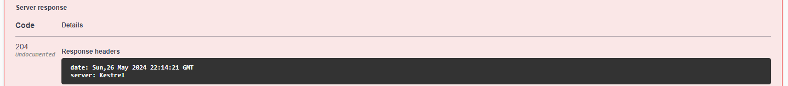

# Тестування працездатності системи

У цьому розділі для тестування RESTful API використовується Swagger - потужний інструмент, що забезпечує зручний інтерфейс для перевірки та взаємодії з API. Swagger дозволяє виконувати запити до різних кінцевих точок, переглядати відповіді сервера та аналізувати коректність виконання операцій, що значно спрощує процес тестування та налагодження системи.

## RESTfulAPI

### Project

### Get (All)
Запит та відповідь сервера

    

### Post
Запит

    

Відповідь сервера

    

### Task

### Get (id)
Запит

    

Відповідь сервера

    

### Team

### Put
Запит

    

Відповідь сервера

    

### Delete

Запит
    

Відповідь сервера

    

### ProjectSchema

    

### ProjectTeamSchema

    

### TaskSchema

    

### TeamSchema

    

